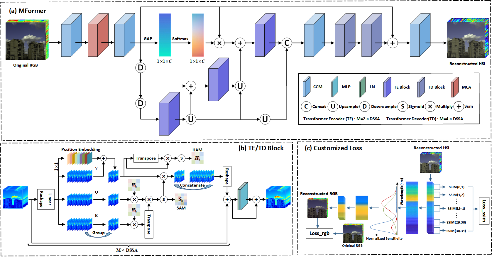
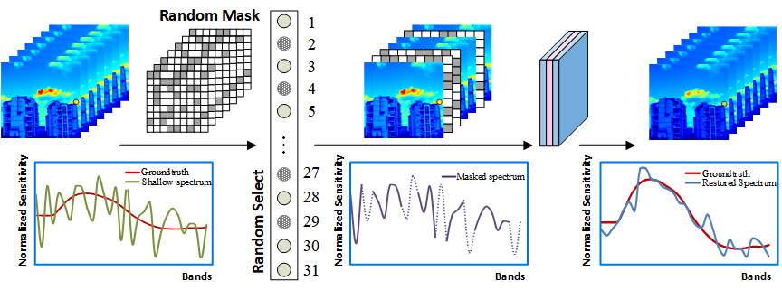

# MFormer: Taming Masked Transformer for Unsupervised Spectral Reconstruction
[Jiaojiao Li](https://scholar.google.com/citations?user=Ccu3-acAAAAJ&hl=zh-CN&oi=ao),  [Yihong Leng](https://superior-leo.gitee.io/), [Rui Song](https://scholar.google.com/citations?user=_SKooBYAAAAJ&hl=zh-CN&oi=sra), [Liu Wei](), [Yunsong Li](), and [Qian Du]() 

<hr />

> **Abstract:** Spectral reconstruction (SR) aims to recover the
> hyperspectral images (HSIs) from the corresponding RGB images directly. Most SR studies based on supervised learning require massive data annotations to achieve superior reconstruction per- formance, which are limited by complicated imaging techniques and laborious annotation calibration in practice. Thus, unsu- pervised strategies attract attention of the community, however, existing unsupervised SR works still face a fatal bottleneck from low accuracy. Besides, traditional CNN-based models are good at capturing local features but experience difficulty in global features. To ameliorate these drawbacks, we propose an unsupervised SR architecture with strong constraints, especially constructing a novel Masked Transformer (MFormer) to ex- cavate latent hyperspectral characteristics to restore realistic HSIs further. Concretely, a Dual Spectral-wise Multi-head Self- attention (DSSA) mechanism embedded in transformer is pro- posed to firmly associate multi-head and channel dimensions and then capture the spectral representation in the implicit solution spaces. Furthermore, a plug-and-play Mask-guided Band Augment (MBA) module is presented to extract and further enhance the band-wise correlation and continuity to boost the robustness of the model. Innovatively, a customized loss based on the intrinsic mapping from HSIs to RGB images and the inherent spectral structural similarity is designed to restrain spectral distortion. Extensive experimental results on three benchmarks verify that our MFormer achieves superior performance over other state-of-the-art supervised and unsupervised methods un- der a no-label training process equally.
<hr />


## MFormer Framework



## MCA


## Unsupervised Spectral Reconstruction

We propose a framework for unsupervised hyperspectral reconstruction. You can carry any SOTA reconstruction network to achieve an unsupervised spectral reconstruction. We are going to enlarge our model zoo in the future. The support list is as follows:

<details open>
<summary><b>Supported algorithms:</b></summary>


* [x] [MST++](https://arxiv.org/abs/2111.07910) (CVPRW 2022)
* [x] [DRCR](https://ieeexplore.ieee.org/document/9857076/) (CVPRW 2022)
* [x] [MST](https://arxiv.org/abs/2111.07910) (CVPR 2022)
* [x] [AWAN](https://arxiv.org/abs/2005.09305) (CVPRW 2020)
* [x] [HRNet](https://arxiv.org/abs/2005.04703) (CVPRW 2020)
* [x] [SUSR](https://ieeexplore.ieee.org/document/9710095/) (ICCV 2019)

## Train
#### 1. **Created Environment.**

- anaconda NVIDIA GPU

- torch-1.9.0+cu111-cp37-cp37m-linux_x86_64

- torchvision-0.10.0+cu111-cp37-cp37m-linux_x86_64

- ```shell
  # next
  pip list --format=freeze > requirements.txt
  ```

#### 2. Download the dataset.

- Download the training spectral images ([Google Drive](https://drive.google.com/file/d/1FQBfDd248dCKClR-BpX5V2drSbeyhKcq/view))
- Download the training RGB images ([Google Drive](https://drive.google.com/file/d/1A4GUXhVc5k5d_79gNvokEtVPG290qVkd/view))
- Download  the validation spectral images ([Google Drive](https://drive.google.com/file/d/12QY8LHab3gzljZc3V6UyHgBee48wh9un/view))
- Download the validation RGB images ([Google Drive](https://drive.google.com/file/d/19vBR_8Il1qcaEZsK42aGfvg5lCuvLh1A/view))

Put all downloaded files to `/MFormer-master/data/`, and this repo is collected as the following form:
 ```shell
	|--data
		|--SRF
		|--2020Train
        |--2020Val
		|--Dataset 
            |--Train_spectral
				|--ARAD_1K_0001.mat
				|--ARAD_1K_0002.mat
				： 
				|--ARAD_1K_0900.mat
			|--Train_RGB
				|--ARAD_1K_0001.jpg
				|--ARAD_1K_0002.jpg
				： 
				|--ARAD_1K_0900.jpg
			|--Valid_soectral
				|--ARAD_1K_0901.mat
				|--ARAD_1K_0902.mat
				： 
				|--ARAD_1K_0950.mat
			|--Valid_RGB
				|--ARAD_1K_0901.jpg
				|--ARAD_1K_0902.jpg
				： 
				|--ARAD_1K_0950.jpg
 ```
#### 3. Data Preprocess.

Before training, you need to split the original datasets into 128*128 by train_data_preprocess and valid_data_preprocess. Then, replace the data location in the file. Finally, you can obtain the running data with:

```shell
cd /MFormer-master/train/

# Getting the prepared train data by run:
python train_data_preprocess.py --data_path './data/Dataset' --patch_size 128 --stride 64 --train_data_path './dataset/2020Train'

# Getting the prepared valid data by run:
python valid_data_preprocess.py --data_path './data/Dataset' --valid_data_path './dataset/2020Val'
```
3. #### Training.
```shell
python mainMFormer.py
```
The data generated during training will be recorded in `/results/MFormer`.
## Test
```shell
python test_model1.py
```
- Download the model for NTIRE2020-CLEAN ( [Baidu Disk](https://pan.baidu.com/s/1DfNVHxuQlRmu-_xD8qOh1w ), code: `1234`))
- Download the model for CAVE ( [Baidu Disk](https://pan.baidu.com/s/115_P5YExwQbyqcB1SLFeFQ ), code: `1234`))
- Download the model for Harvard ( [Baidu Disk](https://pan.baidu.com/s/1JnqUCx5osHb12rQax8CLSg ), code: `1234`))

## Citation
If you find this code helpful, please kindly cite:
```shell
# MFormer
@ARTICLE{MFormer,
  author={Li, Jiaojiao and Leng, Yihong and Song, Rui and Liu, Wei and Li, Yunsong and Du, Qian},
  journal={IEEE Transactions on Geoscience and Remote Sensing}, 
  title={MFormer: Taming Masked Transformer for Unsupervised Spectral Reconstruction}, 
  year={2023},
  volume={61},
  number={},
  pages={1-12},
  doi={10.1109/TGRS.2023.3264976}}

```
